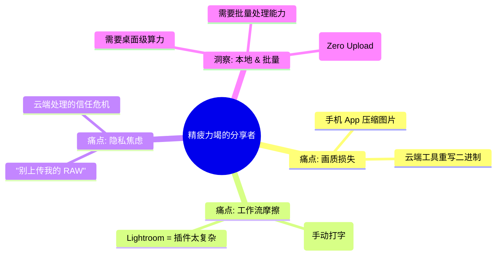
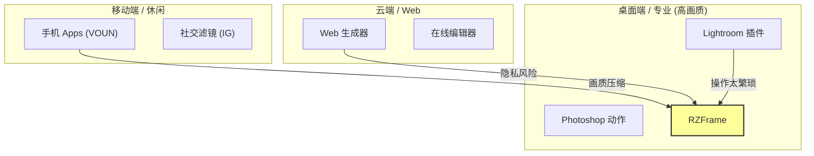
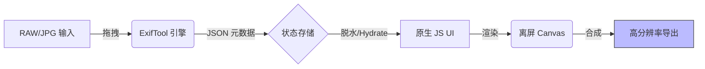
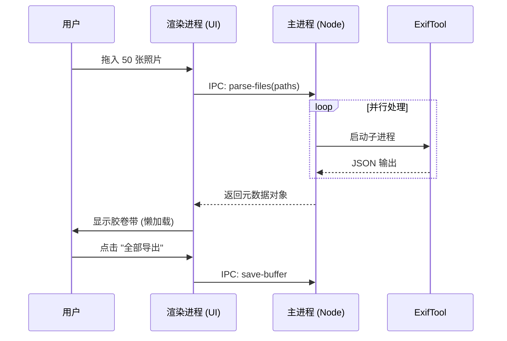

# RZFrame：专业摄影工作的“最后一公里”
> **类别**: 桌面效率工具 / 创意工具
> **角色**: 产品经理 & 全栈开发者
> **状态**: v2.7.2 (Stable)

## 1. 深度洞察：为什么“仅仅是分享”这么累？
摄影师花费数小时拍摄和修图，但最后一步——分享拍摄参数——却是破碎的。把 EXIF 数据粘贴到标题里不仅没人看，还破坏美感；在 Photoshop 里手动加边框既枯燥又耗时（每张图 5-10 分钟）。现有的手机 App 又会压缩高分辨率原图，毁掉画质。

**一句话洞察 (The One-Liner Insight)**：*摄影师希望他们的拍摄参数成为美学的一部分，而不是注脚；同时他们绝不愿为了便利而牺牲 5000 万像素的画质。*

## 2. 竞品与市场：锚定“专业桌面端”生态位
市场上充斥着手机边框 App (Liit, VOUN) 和基于 Web 的生成器。然而，**桌面端 + 隐私 + 批量** 这一象限却惊人地空白。RZFrame 精准切入“专业消费者 (Prosumer)”市场——他们使用专业相机 (Leica/Sony) 拍摄，并在校色显示器上修图。

## 3. 解决方案：决策与取舍
解决方案采用了 **本地优先 (Local-First)** 的工作站模式。核心闭环非常简单：拖拽 -> 解析 -> 渲染 -> 导出。
**关键取舍 (Kano 模型)**:
*   **必备属性 (P0)**: 100% 准确的 EXIF 解析 (基于 `exiftool`)，无损导出。
*   **期望属性 (P1)**: 性能。架构上移除了 React/Vue，使用 **Vanilla JS** 构建，以确保在处理 50+ 这里的批处理时 UI 无卡顿。
*   **魅力属性 (P2)**: "电影模式" (2.35:1 变形宽银幕观感)，自动镜头名称清洗。

## 4. 执行力：“无框架”架构设计 (The "No-Framework" Architecture)
为了处理巨大的图像 Buffer（内存中单张往往超过 100MB），架构设计拒绝了沉重的 frontend 框架。
*   **核心**: Electron (主进程处理 I/O)。
*   **引擎**: `exiftool-vendored` (子进程标准输出解析)。
*   **UI**: 纯 DOM 操作 + Canvas API。零虚拟 DOM (Virtual DOM) 开销。

## 5. 商业与增长：“水印”飞轮效应
RZFrame 是一个产品驱动增长 (PLG) 的工具。使用行为本身就是营销。每一张发布在 小红书/Instagram/Twitter 上带有独特 "RZFrame" 布局的照片，都是一块免费的广告牌。

$$ ROI = \frac{\text{节省时间 (10分钟/张)}}{\text{App 成本 (免费/授权)}} \times \text{品牌一致性} $$

**增长机制**:
1.  **用户价值**: 相比 Photoshop 节省 90% 时间。
2.  **病毒循环**: 用户发布“带参数边框图” -> 观众询问“这是什么 App？” -> RZFrame。
3.  **商业化**: “经典版”免费，“自定义 Logo/字体”付费 (规划中)。
